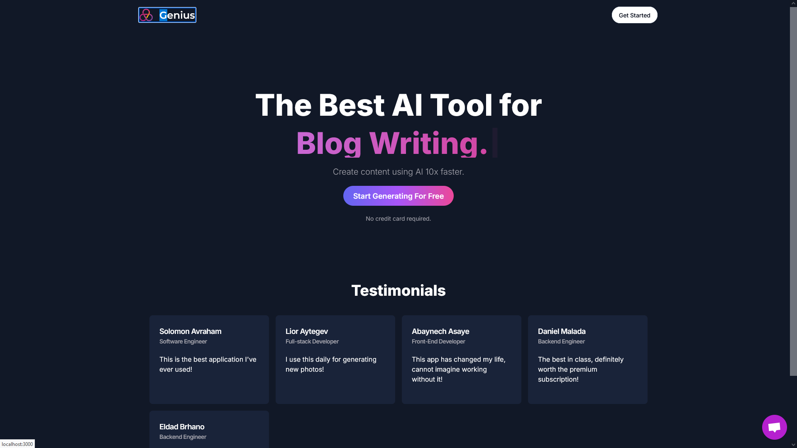

# Genius a AI Platform

Genius is a cutting-edge SaaS AI platform that empowers businesses with powerful Artificial Intelligence capabilities. With seamless integration of Next.js, React, Tailwind CSS, Prisma, and Stripe, Genius offers unparalleled flexibility and efficiency for AI-driven applications.
Key Features

1. Next.js 13: Benefit from the latest features and improvements in the Next.js framework to build robust web applications.
2. React: Leverage the power of React to create interactive user interfaces and dynamic user experiences.
3. Tailwind CSS: Utilize the utility-first CSS framework for rapid UI development and consistent styling.
4. Prisma: Seamlessly manage your application's database with Prisma's powerful and intuitive ORM.
5. Stripe: Enable secure and seamless payment processing with Stripe integration.
6. OpenAI: Tap into advanced AI capabilities with OpenAI, empowering your applications with natural language processing and more.
7. Crisp-Chat: Integrate Crisp-Chat for real-time customer support and engagement.
8. OpenAI-API: Access OpenAI's API directly to leverage state-of-the-art AI models.
9. ClerkAuth: Implement secure authentication and user management with ClerkAuth.
10.Shadcn-UI: UI components for enhanced visual appeal and smoother user interactions.
11.Replicate-API: Data synchronization made easy with Replicate-API.
12.Lucide-React: Icon set for beautiful and scalable vector icons in your React applications.

